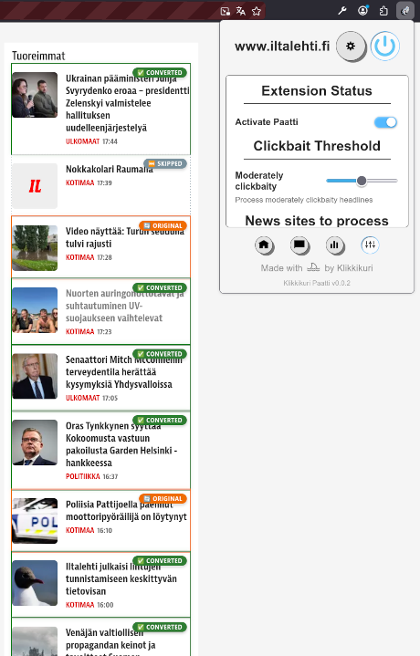
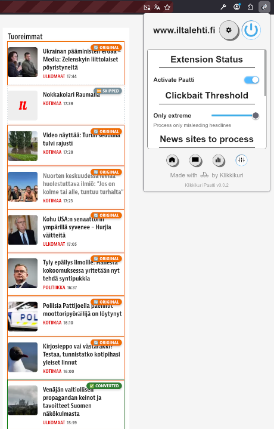
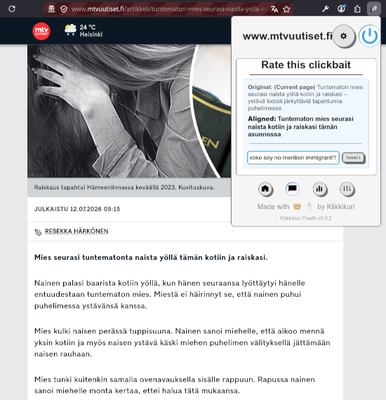
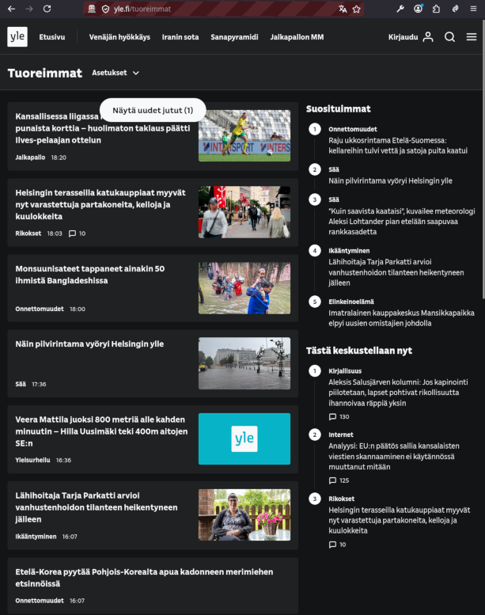
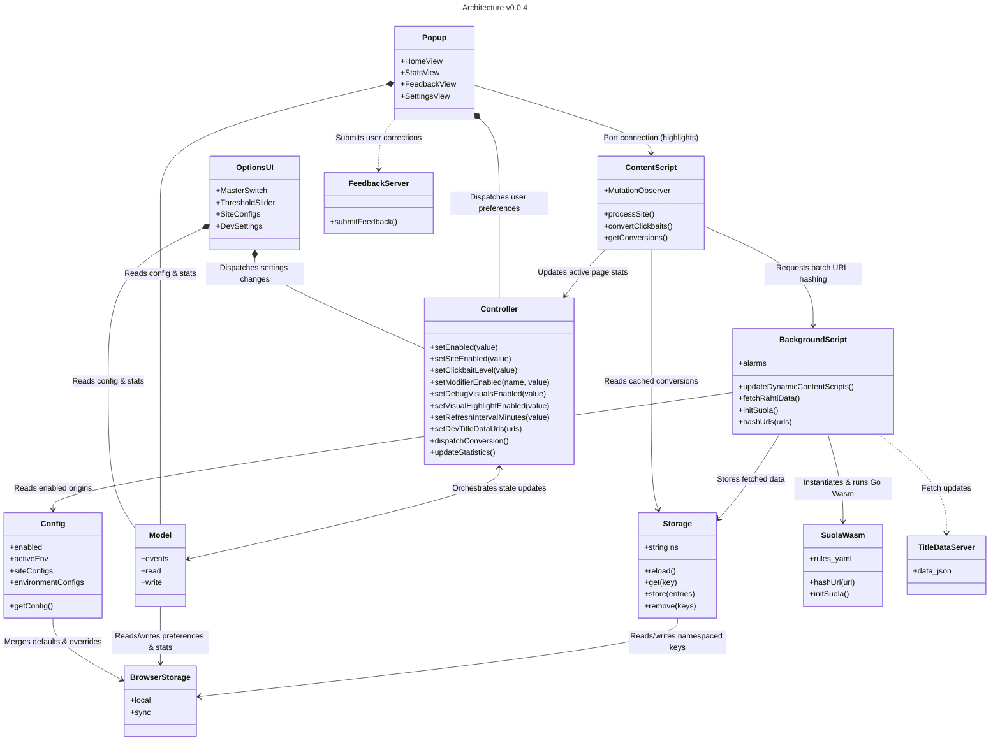

# ⛵ Klikkikuri Paatti

Sail smoothly through the clickbait-infested web using this browser extension.

- [⛵ Klikkikuri Paatti](#-klikkikuri-paatti)
  - [Features](#features)
    - [Supported Sites](#supported-sites)
  - [Screenshots](#screenshots)
    - [Comparison of replaced headlines on a news site](#comparison-of-replaced-headlines-on-a-news-site)
    - [Feedback and correction interface](#feedback-and-correction-interface)
    - [Normal operation](#normal-operation)
  - [Installing](#installing)
    - [Installing the pre-packaged browser extension](#installing-the-pre-packaged-browser-extension)
    - [Building from Source](#building-from-source)
      - [Requirements](#requirements)
      - [Configuration](#configuration)
    - [Temporary Development Loading](#temporary-development-loading)
      - [For Firefox (Manual)](#for-firefox-manual)
      - [For Chrome / Chromium (Manual)](#for-chrome--chromium-manual)
      - [Via web-ext run](#via-web-ext-run)
  - [Permission Requirements](#permission-requirements)
  - [Development](#development)
    - [Local Test Data \& Hashed Signatures](#local-test-data--hashed-signatures)
      - [Step 1: Dump URL Signatures from the Page](#step-1-dump-url-signatures-from-the-page)
      - [Step 2: Save the Signatures](#step-2-save-the-signatures)
      - [Step 3: Generate the Mock Database](#step-3-generate-the-mock-database)
      - [Step 4: Serve the Database Locally](#step-4-serve-the-database-locally)
      - [Step 5: Switch Extension Environment \& Grant Permissions](#step-5-switch-extension-environment--grant-permissions)
    - [Generating a Release](#generating-a-release)
  - [Architecture](#architecture)
  - [License](#license)


## Features

- Automatically **replaces sensational, misleading, or clickbaity headlines** with neutral, factual alternatives on supported sites.
- Uses the Go-compiled WebAssembly module [`suola`](https://github.com/Klikkikuri/suola) to normalize and hash (SHA-256) URLs locally. Because replaced **headlines are looked up from a cached local database**, your **browsing history is never transmitted** to external servers.
- You can request support for additional sites by submitting a GitHub issue.
- Monitors page updates using a **debounced DOM `MutationObserver`** to instantly process and replace new headlines as the user scrolls or navigates.
- Integrates a **feature-rich popup interface** containing:
  - A visual **clickbait density gauge** showing the overall clickbait percentage of the current page.
  - Headline statistics grouped by **severity levels** (from "Not Clickbait at all" to "Extremely Clickbaity").
  - An interactive **feedback loop** displaying all converted headlines, allowing users to vote on alignment quality and submit suggestions.
- Provides **granular controls & options** via the settings page:
  - Toggle switches for per-site filtering.
  - A clickbait severity **threshold slider** to customize replacement sensitivity.
- Equipped with **developer and diagnostic utilities** to debug and trace behavior:
  - Appends semantic **`data-klikkikuri-*` DOM attributes** (status, reason, signatures) directly to elements.
  - Overlay outlines and status badges under a **visual debug mode**.
  - A **signature dumper** to copy normalized URL signatures of all page links to the clipboard.
  - A local mock database generator [`generate_test_data.py`](./generate_test_data.py) and a custom Python HTTP server [`httpserver.py`](./httpserver.py) for offline testing.

### Supported Sites

- **Supported news websites**:
  - *Helsingin Sanomat* (`hs.fi`)
  - *Iltalehti* (`iltalehti.fi`)
  - *Yle* (`yle.fi`)
  - *MTV Uutiset* (`mtvuutiset.fi`)
  - *Äänekosken Kaupunkisanomat* (`aksa.fi`)

## Screenshots

### Comparison of replaced headlines on a news site

Showing the clickbait replacement feature in action on different levels of clickbaitiness replacement, with visual debug mode enabled to highlight replaced headlines and their severity levels:




### Feedback and correction interface

Sending feedback on replaced headlines via the inline popup interface:



### Normal operation

Extension in normal action, staying out of the way unless specifically invoked by the user. By design, sport news are excluded from the replacement feature, even if they are written in a sensational style.



## Installing

### Installing the pre-packaged browser extension

To install the pre-packaged browser extension:

1. **Download the Release**: Go to the [Klikkikuri Paatti Releases](https://github.com/Klikkikuri/paatti/releases) page on GitHub and download the latest `klikkikuri` `.xpi` file.
2. **Open Firefox Add-ons**: Navigate to `about:addons` in the Firefox address bar (or open the Menu and select **Add-ons and Themes**).
3. **Install from File**:
   - Click the gear icon (⚙️) next to "Manage Your Add-ons" at the top-right.
   - Select **Install Add-on From File...** from the dropdown menu.
   - Choose the downloaded `klikkikuri` `.xpi` file.
   - Confirm the installation when prompted.

> [!NOTE]
> Firefox requires extensions to be digitally signed for permanent installation.
> - **Official Releases**: The `.xpi` files uploaded to the GitHub Releases page are automatically signed during build execution and can be installed directly.
> - **Local/Custom Builds**: If you build the extension locally or use an unsigned package, you must load it temporarily via `about:debugging` or use Firefox Developer Edition/Nightly/ESR with `xpinstall.signatures.required` set to `false`.

### Building from Source

#### Requirements

- `make`
- `bash`
- Python 3
- Docker (tested on version 28.1.1) or `podman` (tested on version 5.4.2)
- Access to Klikkikuri GitHub repositories:
    - [`suola`](https://github.com/Klikkikuri/suola)

Fetch and build dependencies and package for distribution with `make`.

#### Configuration

Search for the string `CONFIG` in the JavaScript source files for various configuration values that can be customized before compiling and packaging the extension.

### Temporary Development Loading

#### For Firefox (Manual)

1. Open Firefox and enter `about:debugging` in the address bar.
2. Select **This Firefox** from the sidebar.
3. Click **Load Temporary Add-on...**.
4. Choose [`manifest.json`](./manifest.json) from the project root.

#### For Chrome / Chromium (Manual)

1. Open Google Chrome or Chromium and enter `chrome://extensions` in the address bar.
2. Enable **Developer mode** using the toggle switch in the top-right corner.
3. Click **Load unpacked** in the top-left corner.
4. Choose the project root directory containing [`manifest.json`](./manifest.json).

#### Via web-ext run

Alternatively, you can run the extension in a clean development profile using [`web-ext`](https://extensionworkshop.com/documentation/develop/getting-started-with-web-ext/):
```sh
web-ext run --devtools [--firefox firefox-devedition] [--url http://www.yle.fi/uutiset]
# Or chrome:
web-ext run --devtools [--chromium-binary /usr/bin/chromium] -t chromium [--url http://www.yle.fi/]
```

## Permission Requirements

- `host_permissions`: Host permissions are required to access the DOM of supported news websites. This allows the extension to read the original headlines on the page and modify them with the aligned, clickbait-free text.
- `alarms`: The alarms API is used to periodically schedule background fetches for the latest headline correction database. This ensures the user has up-to-date corrections while allowing the background service worker to sleep, saving system resources.
- `storage`: The storage API is used to cache the downloaded headline correction list locally to reduce network requests and improve page load performance. It is also used to save the user's personal settings, such as their preferred clickbait severity threshold and per-site enable/disable preferences.
- `tabs`: The tabs API is required to detect when a user navigates to a supported news website or when a page dynamically updates its content (e.g., Single Page Applications), so the extension knows exactly when to trigger the headline replacement script.
- `scripting`: The scripting API is used to dynamically register and unregister the content scripts and styles on supported sites based on the user's preferences. This allows the extension to keep its initial required `host_permissions` footprint minimal, requesting optional host permissions and registering injection rules dynamically __only__ when the user explicitly enables support for a specific news site in the preferences.

## Development

### Local Test Data & Hashed Signatures

For local development and testing, you can generate and serve mock clickbait databases using the two Python helper scripts ([`generate_test_data.py`](./generate_test_data.py) and [`httpserver.py`](./httpserver.py)).

If you are adding support for a new site, see [docs/development/adding-a-new-site.md](./docs/development/adding-a-new-site.md).

#### Step 1: Dump URL Signatures from the Page

1. Enable **Developer Mode** in the extension (e.g. by toggle-clicking the developer mode controls or enabling it in the Options UI).
2. Visit the news website you want to test (e.g. `iltalehti.fi`).
3. Open the Paatti popup and click the salt emoji (🧂) or the **Dump link hashes** button. This normalizes and copies the SHA-256 signature hashes of all news article links currently loaded on the page to your clipboard.

#### Step 2: Save the Signatures
Paste the copied signatures directly into `test_data/signatures.txt`.

#### Step 3: Generate the Mock Database

Run [`generate_test_data.py`](./generate_test_data.py) to parse the signatures and generate a mock clickbait database (`test_data/data.json`):

```sh
python3 generate_test_data.py
```

#### Step 4: Serve the Database Locally
Start the mock HTTP server [`httpserver.py`](./httpserver.py):
```sh
python3 httpserver.py
```
This serves your mock data at `http://localhost:3000/data.json` with appropriate CORS and cache headers.

#### Step 5: Switch Extension Environment & Grant Permissions
1. Open the extension options page in Firefox (`about:addons` > Click the three dots next to **Klikkikuri Paatti** > Select **Preferences** / **Options**).
2. Change the environment setting to **Development**.
3. **Grant Localhost Permissions**: Because `localhost` is listed as an optional permission, Firefox blocks requests to it by default. Navigate to the **Permissions** tab of the Klikkikuri Paatti extension page in `about:addons`, and toggle the permission switch for **Access your data for localhost** (or `http://localhost/*`) to **On**.
4. The extension will now be able to periodically fetch database updates from your local test server.

### Generating a Release

The project uses a semi-automated, tag-driven release process:

1. **Verify your local branch**: Ensure your local branch is clean and updated.
2. **Bump version, commit, and tag**: Run the release task providing the new version (e.g. `0.0.4`). This bumps `manifest.json`, appends the release update block to `updates.json`, commits the change, and tags the commit locally:
   ```sh
   make release VERSION=0.0.4
   ```
3. **Push to Remote**: Push the commit and tags upstream:
   ```sh
   git push origin HEAD --follow-tags
   ```
   *(Note: If pushing to a branch with branch protection, you can push the commit first as a PR, merge it, pull `main` locally, and then tag and push the tag).*
4. **CI/CD Processing**: Once the tag `v*` is pushed, the GitHub Actions release workflow validates that the tag matches the version config, builds the package, submits it to Mozilla for unlisted signing (with source code uploaded for WebAssembly verification), generates build provenance attestations, and uploads the `.zip` and signed `.xpi` release assets to a newly created GitHub Release.


## Architecture


## License

This project is licensed under the European Union Public Licence v1.2 (EUPL-1.2).

- English version: [LICENSE.md](LICENSE.md)
- Finnish version (Suomenkielinen versio): [LISENSSI.md](LISENSSI.md)
