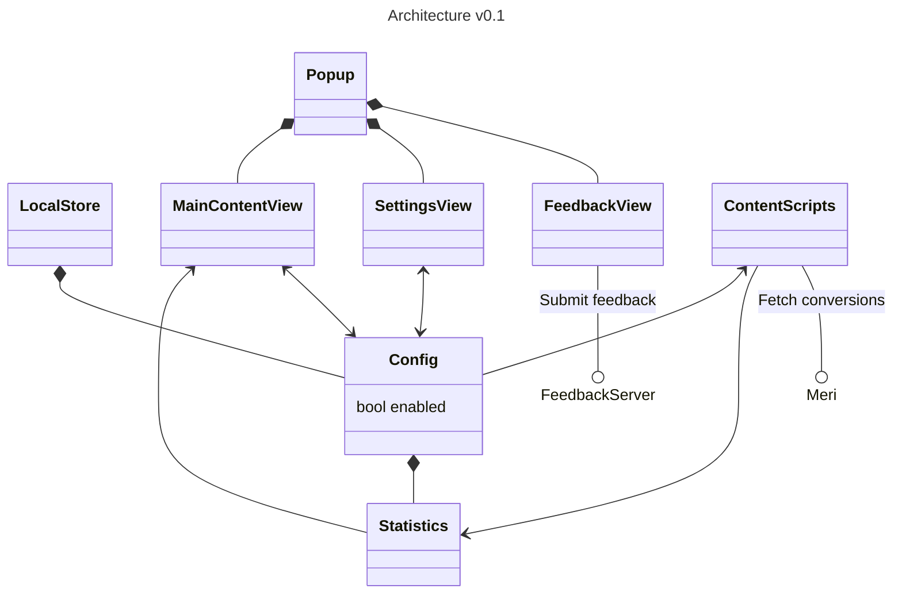

# ⛵ Paatti

Sail smoothly through the clickbait-infested web using this browser extension.

## Installing

### Building
Requirements
- `bash`
- Python 3
- Docker (tested on version 28.1.1) or `podman` (tested on version 5.4.2)
- Access to Klikkikuri GitHub repositories:
    - `suola`

Fetch and build dependencies by running the `./build.sh` script.

### Configuration
Search for string `CONFIG` from the JavaScript files for various points where configuration values can be edited.

## How do I get it on my browser

### For Firefox

Enter `about:debugging` to the address bar and from the This Firefox -tab select any file at project root (e.g., `manifest.json`) from Load Temporary Add-on...

#### Packaging
Requirements
- `bash`
- `zip`

Use the `./package.sh` script to create a `.zip` archive that can be shared more easily. When adding to browser now just choose the `.zip` file instead.

#### web-ext run

Alternatively, you can use [`web-ext`](https://extensionworkshop.com/documentation/develop/getting-started-with-web-ext/) to run the extension:
```sh
web-ext run --devtools [--firefox firefox-devedition] [--url http://www.yle.fi/uutiset]
```

## Development

### Test data
Start the local HTTP server to serve test data:
```sh
python3 httpserver.py
```

### Visual Studio Code debugging
You can also use Visual Studio Code to debug the extension. See the `.vscode/launch.json` for configuration.

## Architecture

