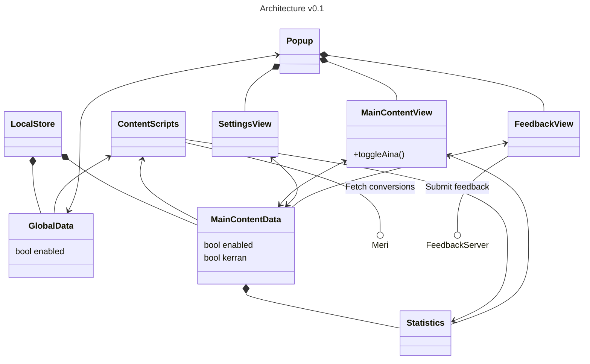

# ⛵ Paatti

Browser extension to sail the web.


## Installing (development)
### Requirements
- Python 3
- Docker (tested on version 28.1.1)
- Access to Klikkikuri GitHub repositories:
    - `suola`

### Configuration
Search for string `CONFIG` from the JavaScript files for various points where configuration values can be edited.

### How to
Fetch and build dependencies by running:
```bash
./build.sh
```

For Firefox enter `about:debugging` to the address bar and from the This Firefox -tab select any file at project root (e.g., `manifest.json`) from Load Temporary Add-on...

## Architecture

