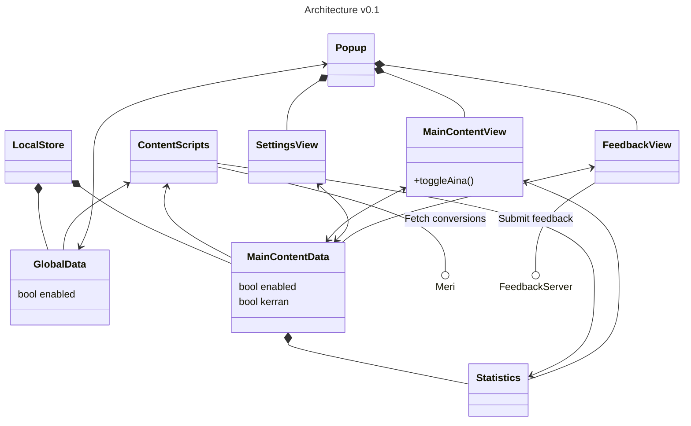

# ⛵ Paatti

Browser extension to sail the web.


## Installing (development)
### Requirements
- Python 3
- Docker (tested on version 28.1.1)
- Access to Klikkikuri GitHub repositories:
    - `suola`

### Configuration
Search for string `CONFIG` from the JavaScript files for various points where configuration values can be edited.

### How to
Fetch and build dependencies by running:
```sh
./build.sh
```

Start the local HTTP server to serve test data:
```sh
python3 httpserver.py
```

#### Load extension in browser

For Firefox enter `about:debugging` to the address bar and from the This Firefox -tab select any file at project root (e.g., `manifest.json`) from Load Temporary Add-on...

#### web-ext run

Alternatively, you can use [`web-ext`](https://extensionworkshop.com/documentation/develop/getting-started-with-web-ext/) to run the extension:
```sh
web-ext run --devtools [--firefox firefox-devedition] [--url http://www.yle.fi/uutiset]
```

#### Visual Studio Code debugging
You can also use Visual Studio Code to debug the extension. See the `.vscode/launch.json` for configuration.

## Architecture

