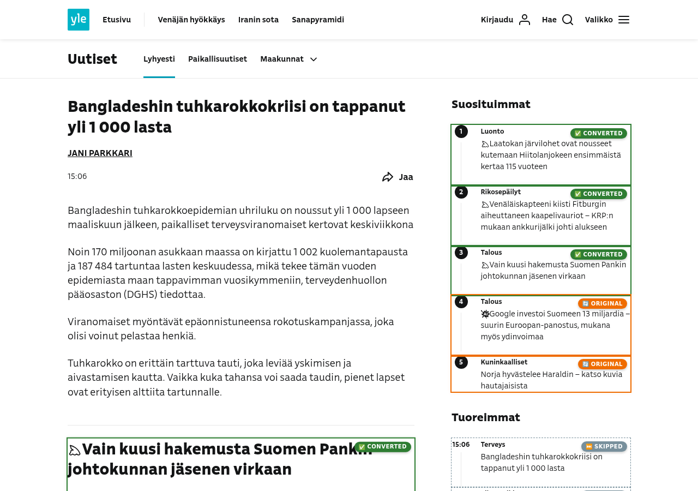
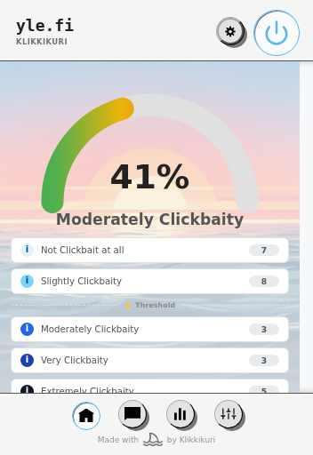
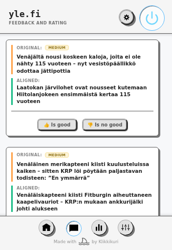
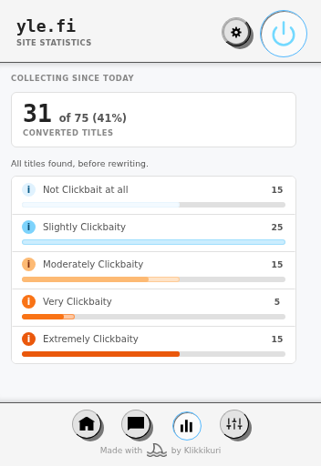
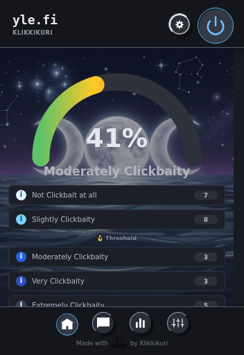
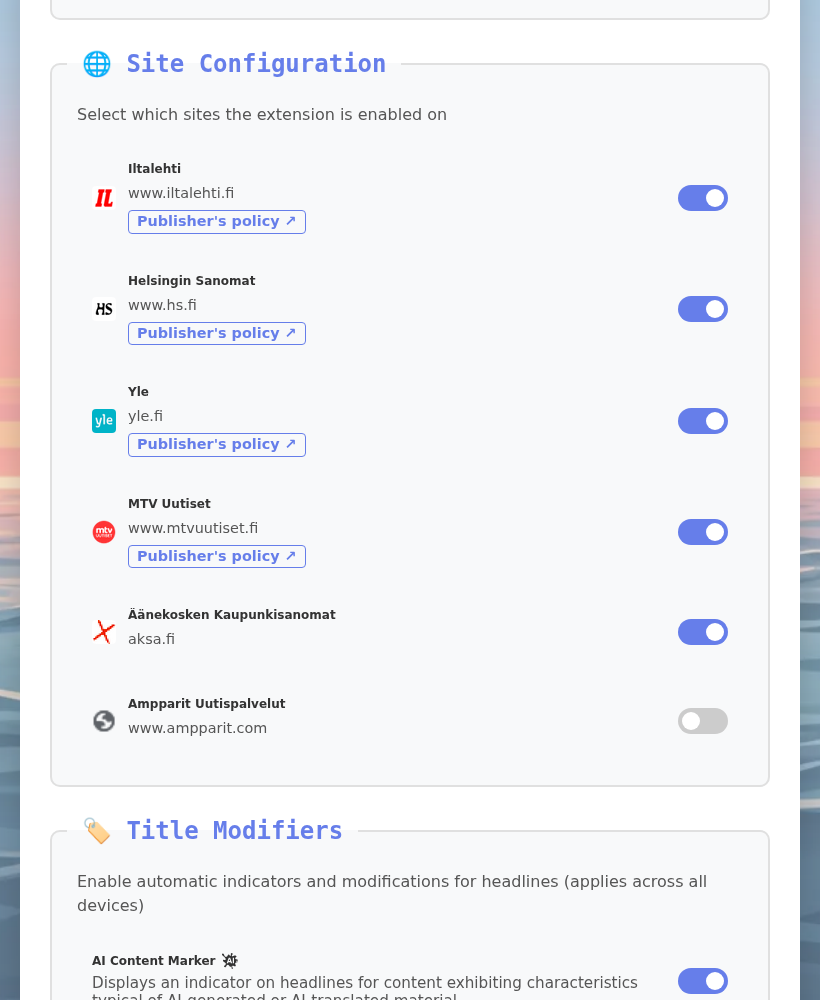
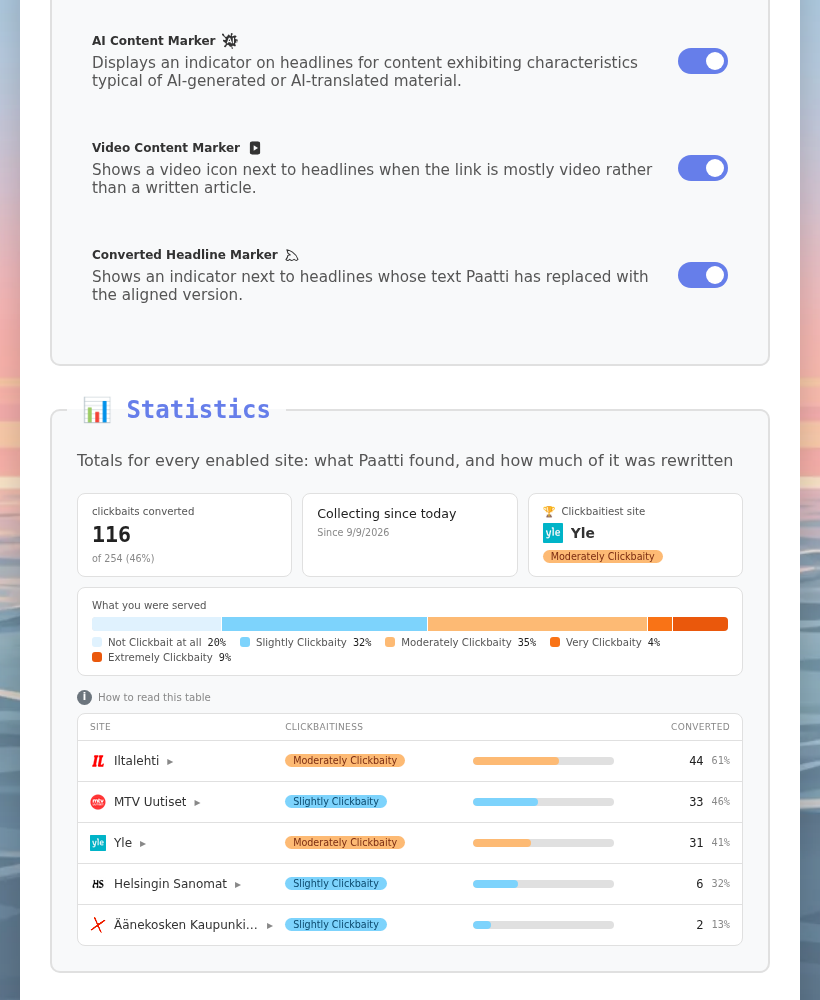

# ⛵ Klikkikuri Paatti

Sail smoothly through the clickbait-infested web using this browser extension.

- [⛵ Klikkikuri Paatti](#-klikkikuri-paatti)
  - [Features](#features)
  - [Supported Sites](#supported-sites)
    - [Works After You Install](#works-after-you-install)
    - [Needs Your Permission First](#needs-your-permission-first)
  - [Screenshots](#screenshots)
    - [Replaced Headlines on a News Site](#replaced-headlines-on-a-news-site)
    - [Normal Operation](#normal-operation)
    - [Feedback Without Leaving the Page](#feedback-without-leaving-the-page)
    - [The Popup](#the-popup)
    - [Dark Mode](#dark-mode)
    - [Settings](#settings)
  - [Install](#install)
    - [From a Browser Store](#from-a-browser-store)
    - [From a GitHub Release](#from-a-github-release)
  - [Permission Requirements](#permission-requirements)
  - [How It Works](#how-it-works)
  - [Privacy Policy](#privacy-policy)
  - [License](#license)
    - [Non-OSS Assets](#non-oss-assets)
  - [Development](#development)
    - [Build from Source](#build-from-source)
      - [Requirements](#requirements)
      - [Build Flags and Options](#build-flags-and-options)
    - [Load a Development Build](#load-a-development-build)
    - [Run the Tests](#run-the-tests)
    - [Lint](#lint)
    - [Environments](#environments)
    - [Developer and Diagnostic Utilities](#developer-and-diagnostic-utilities)
    - [Badge Icons](#badge-icons)
    - [Local Test Data and Hashed Signatures](#local-test-data-and-hashed-signatures)
    - [Architecture](#architecture)
    - [Make a Release](#make-a-release)

## Features

- Paatti **replaces sensational, misleading and clickbaity headlines** with neutral, factual alternatives on
  supported sites.
- The extension **looks up headlines in a database on your own device**. It downloads that database from
  GitHub at intervals. It **does not send your browsing history** to an external server, unless you take an
  explicit action such as sending feedback. See the [Privacy Policy](docs/PRIVACY_POLICY.md).
- The Go-compiled WebAssembly module [`suola`](https://github.com/Klikkikuri/suola) **normalizes and hashes
  (SHA-256) each URL locally**, so a lookup needs no network request.
- A debounced DOM `MutationObserver` watches the page. **Paatti replaces new headlines as you browse** or as
  the site loads more content.
- Paatti fully supports **Firefox for Android**, **Firefox**, **Chrome**, **Chromium**, and **Brave**.
- The user interface is fully **translated** and available in **English and Finnish**.
- The popup and the settings page **follow your browser's light or dark theme** by themselves. The markers
  Paatti puts on a news page instead take the colours of the site around them, so they stay legible on a dark
  site and on a light one.
- Adjustable **clickbait threshold** to set how clickbaity a headline must be before Paatti replaces it.
- The popup shows:
  - A **clickbait density gauge** for the page you are on.
  - Headline counts grouped by severity, from "Not Clickbait at all" to "Extremely Clickbaity".
  - A **feedback list** of the headlines Paatti changed. You can rate a replacement, send a suggestion, and
    open an **expando section** that shows the headlines below your threshold.
  - The **database status**: when Paatti last downloaded corrections, and a button to download them now. You
    can also set how often it checks.
  - A **shortcut that searches the GitHub issues** for the site you are on, so you can see whether support for
    it was already requested. To request a new site, open an issue.
- The settings page gives you:
  - A **switch for each supported site**.
  - A **threshold slider** that sets how clickbaity a headline must be before Paatti replaces it.
  - Three **headline markers**. Only the AI Content Marker is on when you install Paatti; switch the other two
    on if you want them, or switch all three off to let Paatti work with no visible mark at all:
    - The **AI Content Marker** tells you that the article shows characteristics typical of AI-generated or
      AI-translated material. Use it to decide whether an article is worth your time, if the author did not bother writing it themselves.
    - The **Video Content Marker** tells you that a link leads mostly to video rather than to a written article.
    - The **Converted Headline Marker** tells you that Paatti replaced this headline. It is a button: click it,
      or move to it with the keyboard and press Enter, to open the feedback card for that headline.

## Supported Sites

Sites fall into two groups. The group decides whether Paatti starts by itself, or waits for you.

### Works After You Install

Paatti starts on these sites immediately. It needs no further action from you.

- *Helsingin Sanomat* (`hs.fi`)
- *Iltalehti* (`iltalehti.fi`)
- *Yle* (`yle.fi`)
- *MTV Uutiset* (`mtvuutiset.fi`)
- *Äänekosken Kaupunkisanomat* (`aksa.fi`)

### Needs Your Permission First

- *Ampparit Uutispalvelut* (`ampparit.com`)

This site is off by default. When you switch it on in the settings, the browser asks you to approve access to
it. Paatti starts on the site only after you approve. If you decline, the site stays off. If you switch it on
from the popup, the popup closes, because the browser cannot show the approval prompt inside a popup.

To ask for support for another site, open an issue on GitHub.

## Screenshots

### Replaced Headlines on a News Site

The same Yle "Suosituimmat" list at two threshold settings, with the visual debug mode on. The coloured outline
and the badge on each card are developer tools that are off by default — they are here to make the threshold
visible. Green **CONVERTED** means Paatti replaced the headline, orange **ORIGINAL** means it left it alone.

At **Moderately clickbaity**, the top three stories are replaced. The first reads "Laatokan järvilohet ovat
nousseet kutemaan Hiitolanjokeen ensimmäistä kertaa 115 vuoteen".



At **Only extreme**, nothing in the list clears the bar, so every card keeps the site's own wording. The same
first story now reads "Venäjältä nousi koskeen kaloja, joita ei ole nähty 115 vuoteen – nyt vesistöpäällikkö
odottaa jättipottia", which withholds the fact the replacement states.


### Normal Operation

The same page as a user sees it, with the debug mode off. No outlines and no status badges: the page reads as
Yle's own. The only sign of Paatti is the small marker before each headline it changed, and the AI Content
Marker on the Google story further down.

All three markers are switched on here. A new install shows only the AI Content Marker — the Video Content
Marker and the Converted Headline Marker start off. Each has its own switch, so you can also turn all three off
and let Paatti replace headlines leaving no visible mark.


### Feedback Without Leaving the Page

Clicking the Converted Headline Marker opens this card beside the headline, so you can rate a replacement while
you read. It names the site's **ORIGINAL** headline and its severity, shows the **ALIGNED** replacement under
it, and outlines the headline the card belongs to.

This card is the marker's own function, so it needs the Converted Headline Marker switched on — which a new
install does not do. Without the marker there is nothing to click, and the popup's feedback view is the way to
rate a replacement; it lists every one on the page.


### The Popup

The home view rates the page you are on. The gauge gives one number for the whole page, and the rows below
count the headlines at each severity. The dotted line labelled **Threshold** sits where your setting is: rows
above it are left alone, rows below it are replaced. You can drag that line to change the setting.



The feedback view lists what Paatti changed on this page. Each entry shows the site's **ORIGINAL** headline with
its severity, the **ALIGNED** replacement underneath, and two buttons to say whether the replacement is fair, or send feedback if it should be improved.



The statistics view totals what Paatti has seen on this site since it started counting.



### Dark Mode

Paatti's own pages follow `prefers-color-scheme`, so they turn dark when your browser or system does. There is
no theme setting to keep in step, and the background artwork has a night version of its own.



The markers Paatti adds to a news page work the other way round, and deliberately so. They paint with the
page's own text colour and knock the glyph out of it, so they read correctly against whatever the site uses. A
marker that followed the system theme instead would come out black on a dark site whenever the system was set
to light. [`src/components/badge-style.js`](./src/components/badge-style.js) carries the reasoning.

### Settings

Each supported site has its own switch, showing the site's own icon. Ampparit is off, because it is the site
that needs your permission first. Below the list sits a switch for each of the three headline markers; all
three are on in this picture, but a new install starts with only the AI Content Marker.



The statistics section totals every enabled site, and names the one that was most clickbaity.



## Install

### From a Browser Store

Install Klikkikuri Paatti from the [🛍️ Google Chrome Web
Store](https://chromewebstore.google.com/detail/klikkikuri-paatti/jalegaigmgljhnaakmbbaajooffgcbgc?hl=en) or
from [🦊 Mozilla Firefox Add-ons](https://addons.mozilla.org/fi-FI/firefox/addon/klikkikuri/). Use a store
version unless you want to develop the extension or to test a newer build.

Paatti needs Firefox 128 or later, or Chrome 122 or later. Firefox for Android is supported.

### From a GitHub Release

To install the packaged extension in Firefox:

1. **Download the release.** Go to the [Klikkikuri Paatti
   releases](https://github.com/Klikkikuri/paatti/releases) page and download the newest `klikkikuri-paatti`
   `.xpi` file.
2. **Open the Firefox add-ons page.** Enter `about:addons` in the address bar, or open the menu and select
   **Add-ons and Themes**.
3. **Install from the file.**
   - Click the gear icon (⚙️) next to "Manage Your Add-ons".
   - Select **Install Add-on From File...**.
   - Select the `.xpi` file you downloaded.
   - Confirm the installation.

Chrome does not permit an extension to install from a file in the same way, so a `.crx` build is not always
available.

## Permission Requirements

- `host_permissions`: Paatti reads the headlines on the supported news sites and replaces their text, so it
  needs access to those pages. This permission also covers
  `raw.githubusercontent.com/Klikkikuri/rahti/*`, which is where Paatti downloads the correction database
  from.
- `optional_host_permissions`: Paatti asks for these only when you need them. `www.ampparit.com` is requested
  when you switch that site on. `http://localhost/*` is requested only for local development.
- `alarms`: Paatti schedules the database download in the background. The alarm lets the background service
  worker sleep between downloads, which saves system resources.
- `storage`: Paatti keeps the downloaded correction database, your settings, your statistics and the site icon
  cache on your device. Your settings follow your browser profile if you use browser sync.
- `tabs`: Paatti must know when you open a supported news site, and when a site replaces its content without a
  page load. It uses this to decide when to examine the page.
- `favicon`: Chromium keeps the icons of the sites you visit, and this permission lets Paatti read one from
  that cache with no network request. Where the cache has no icon, Paatti shows an icon it stored earlier, and
  if it has none, a generated letter badge. To fill that store, Paatti reads the icon address from a supported
  page and downloads the icon once per site, without cookies and without a referrer, then keeps it for 30 days.
- `scripting`: Paatti registers and unregisters its content script per site, which is how a site switch takes
  effect without a browser restart. It also lets Paatti hold no permission at all for an optional site until
  you switch that site on.

## How It Works

Klikkikuri Paatti is the browser extension. Three other projects stand behind it:

- [meri](https://github.com/Klikkikuri/meri) reads the articles, judges whether a headline matches the article,
  and writes a neutral replacement.
- [suola](https://github.com/Klikkikuri/suola) normalizes and hashes URLs. The backend and the extension use
  the same module, so both sides agree on the signature for an article.
- [rahti](https://github.com/Klikkikuri/rahti) publishes the result as
  [`data.json`](https://raw.githubusercontent.com/Klikkikuri/rahti/refs/heads/main/data.json).

Paatti downloads that file, keeps it on your device, and looks each headline up in it. Your browsing does not
leave your machine to make a lookup.

Which headlines the database covers is decided by the backend, not by the extension. Sports headlines, for
example, are not corrected, although they are often written in a sensational style.

For more about the projects, see the [Klikkikuri organization profile](https://github.com/Klikkikuri).

## Privacy Policy

For information about data handling and user privacy, please refer to our [Privacy
Policy](docs/PRIVACY_POLICY.md).

## License

This project is licensed under the European Union Public Licence v1.2 (EUPL-1.2).

- English version: [LICENSE.md](LICENSE.md)
- Finnish version (Suomenkielinen versio): [LISENSSI.md](LISENSSI.md)

### Non-OSS Assets

The assets in [`assets/non-oss/`](./assets/non-oss/) are not covered by the EUPL-1.2 license.

- The AI Content Marker icon in [`assets/non-oss/by-kagi/`](./assets/non-oss/by-kagi/) is designed by and
  copyright of [Kagi Inc.](https://kagi.com/) and used with permission (see
  [`assets/non-oss/by-kagi/PERMISSION.txt`](./assets/non-oss/by-kagi/PERMISSION.txt)).

`make build` leaves these assets out. The build must opt in with `NON_OSS=1`, which the release workflow does —
so the packages published to the stores and to GitHub Releases do contain the Kagi icon. A build without
`NON_OSS=1` draws the marker with the EU-styled vector badge in [`assets/icons/`](./assets/icons/) instead.

---

## Development

Read **[AGENTS.md](AGENTS.md)** before you change anything under `src/`. It holds the binding conventions of
this repository: how to reach the extension API, the three populations of web components and why they differ,
where a stylesheet belongs, and the traps around settings, extractor registration and prompts.

### Build from Source

```sh
make build
```

`make build` first checks that the `suola` submodule is present. It then compiles `suola` to WebAssembly
(`js.wasm` and its support file `wasm_exec.js`) with Docker, or with a host toolchain when `DOCKER=false`. The
two files must come from the same toolchain to work together, so run `make clean` when you change build method.
Finally it stages the extension assets (`src/`, `icons/`, `_locales/`, `manifest.json`, `LICENSE.md`,
`LISENSSI.md` and `docs/PRIVACY_POLICY.md`) with the WebAssembly binaries into `build/dist/`, and packages them
into `build/klikkikuri-paatti.zip`.

If the `suola` submodule is missing, `make` fetches it with `make init`. You can also clone the repository
with `git clone --recursive` to get it from the start.

#### Requirements

- `make`, `bash`, `git`, `zip` and `curl`
- Node.js. Every build runs `check-icons`, and `make test` and the release task need it too.
- `eslint` and `web-ext` for the lint targets. Both come from the dev container image.
- (optional) Docker (tested on version 28.1.1) or `podman` (tested on version 5.4.2)
- (optional, for the test-data helpers) Python 3
- The [`suola`](https://github.com/Klikkikuri/suola) submodule
  - TinyGo 0.41+, to compile it locally without Docker

#### Build Flags and Options

Pass `DOCKER=false` to **compile suola on the host** instead of in a container:

```sh
make build DOCKER=false
```

Pass `DOCKER=podman` to **build with podman**:

```sh
make build DOCKER=podman
```

Pass `USE_RELEASE_ARTIFACTS=1` to **download the WebAssembly binaries** from GitHub instead of compiling them.
The `suola` checkout must sit on an exact tag, which it does after a recursive clone:

```sh
make build USE_RELEASE_ARTIFACTS=1
```

Pass `NON_OSS=1` to **include the non-OSS assets**, which overlays `assets/non-oss/by-kagi/` onto `src/`:

```sh
make build NON_OSS=1
```

Other targets: `make package` zips a staged build, `make source-dist` packages the source for review,
`make rebuild-suola` forces a WebAssembly rebuild, and `make test-wasm` runs suola's own smoke test.

`make init` fetches the `suola` submodule. Do not use `make test-data`: it passes a signature-file path that
[`generate_test_data.py`](./generate_test_data.py) ignores. Call the script directly instead, as described in
[Local Test Data and Hashed Signatures](#local-test-data-and-hashed-signatures).

### Load a Development Build

Use [`run.sh`](./run.sh). It builds the extension and starts a browser with a clean profile:

```sh
./run.sh                        # Firefox
./run.sh --ff                   # Firefox Developer Edition
./run.sh --cr                   # Chromium
./run.sh --dark                 # Force the dark theme
./run.sh -u https://yle.fi/     # Open this page on startup
./run.sh -s .                   # Run a directory as-is, instead of build/dist
```

`run.sh` reads [`web-ext-config.cjs`](./web-ext-config.cjs) from the repository root, which carries the browser
preferences and the watch-ignore patterns.

The repository root is itself a loadable unpacked extension, so you can also load
[`manifest.json`](./manifest.json) by hand: in Firefox through `about:debugging` → **This Firefox** → **Load
Temporary Add-on...**, and in Chrome through `chrome://extensions` → **Developer mode** → **Load unpacked**.
See the [Firefox](https://extensionworkshop.com/documentation/develop/temporary-installation-in-firefox/) and
[Chrome](https://developer.chrome.com/docs/extensions/get-started/tutorial/hello-world#load-unpacked) documentation
for the current steps.

### Run the Tests

```sh
make test
```

The suites live in `tests/` and run on the built-in [`node:test`](https://nodejs.org/api/test.html) runner. A new
`tests/*.test.mjs` file is picked up automatically — nothing to register. Shared fixtures go under
`tests/helpers/`, which the runner does not treat as suites. `make test` also runs `suola`'s Wasm smoke test when
`build/` holds the artifacts, and skips it with a note when it does not.

Tests that touch the extension APIs use the in-memory fake in
[`tests/helpers/fake-browser.mjs`](./tests/helpers/fake-browser.mjs), which really dispatches
`storage.onChanged`. Assign it to `globalThis.browser` **before** a dynamic `await import(...)` of the module
under test — `src/browser-api.js` resolves the namespace once, at module evaluation, so a static import would
beat the assignment.

Tests that need a DOM use [`tests/helpers/dom.mjs`](./tests/helpers/dom.mjs), which puts a jsdom document on
`globalThis`. Install it before the dynamic import as well: a component module builds its templates and calls
`customElements.define` at evaluation time. jsdom comes from the dev container image rather than a
`package.json`, so `make test` needs the container — the `test` target points `NODE_PATH` at the global npm root,
because ESM resolution ignores it and the helper reaches jsdom through the CJS resolver.

jsdom does no layout and does not resolve the cascade, so it covers structure, lifecycle and events but says
nothing about styling. Check CSS in a real browser instead.

### Lint

```sh
make lint          # eslint; this is what CI runs
make lint-webext   # web-ext lint; run this by hand
```

`make lint` rejects a bare `browser` or `chrome` global and `globalThis.browser`. See
[AGENTS.md](AGENTS.md) for the two exempt files and the reason for the rule.

`make lint-webext` is deliberately not part of `make lint`, and CI does not run it: `web-ext lint` reports an
error for the gecko `update_url` that this project needs for self-hosted Firefox updates. Read its report and
keep the `UNSAFE_VAR_ASSIGNMENT` count at zero — that count is the one signal that separates a static template
from markup a caller can influence.

### Environments

Paatti carries three environments, defined in `DEFAULT_CONFIG.environmentConfigs` in
[`src/config.js`](./src/config.js). They differ in how often the database refreshes, which markers start on, and
which database URLs are used.

| Environment | Purpose |
|---|---|
| `free` | The released default. Downloads `data.json` from rahti. |
| `paid` | Reserved for a paid service with additional lists. Not yet available. |
| `development` | Refreshes every minute, turns the debug visuals on, and adds `http://localhost:3000/data.json` to the database URLs. |

**An unpacked build selects `development` by itself**, because `management.getSelf().installType` reports
`development` for it. The defaults you see in a build you loaded yourself are therefore not the defaults a user
gets from a store. Keep this in mind when you check behaviour or take screenshots.

### Developer and Diagnostic Utilities

Turn developer mode on by clicking the logo at the foot of the popup, beside "Made with". A 🤓 appears next to
it while developer mode is on, and the hidden controls become visible. Turning it on switches the environment to
`development`; turning it off switches back to `free`.

- Paatti writes **`data-klikkikuri-*` attributes** on the elements it examined: `status`, `url-sign`,
  `clickbait-level`, `original-title`, `converted-title`, `labels` and `highlight-id`. Read them in the
  inspector to see what Paatti decided and why.
- **Visual debug mode** draws an outline and a status badge over each examined headline. The badge names the
  status Paatti gave it: converted, original, 🔒 paywalled, skipped or error. Two settings control the overlay:
  `debugVisualsEnabled` comes from the environment, and `visualHighlightEnabled` is your own override. Note
  that an open popup forces the outlines on, whatever the setting says.
- The **signature dumper** copies the normalized SHA-256 signature of every article link on the page to the
  clipboard. Use the 🧂 button, or the **Copy to Clipboard** button in the popup's **Salt Signatures** section.
- The **Developer Settings** section of the settings page takes several database URLs (`titleDataUrls`), so you
  can point Paatti at a local server.

### Badge Icons

The icons the in-page badges draw are authored as standalone SVG files under [`assets/icons/`](./assets/icons/) —
Kagi's beside its permission file in [`assets/non-oss/by-kagi/`](./assets/non-oss/by-kagi/). Edit one in a vector
editor, then write it into the module that draws it:

```sh
make icons
```

Each badge module names its source and fences the region the generator owns:

```js
// @icon-source assets/icons/video-badge.svg
// BEGIN GENERATED ICON -- edit the .svg, then run `make icons`
const svgMarkup = `…`;
// END GENERATED ICON
```

The generated block is committed on purpose. The project root is itself a loadable unpacked extension (see
[Load a Development Build](#load-a-development-build)) and there is no bundler, so a module cannot resolve its
icon at load time and `src/` must never hold a placeholder. `make dist` runs `make check-icons` first and fails
when a module has drifted from its SVG, naming the file to regenerate.

[`tools/inline-icons.mjs`](./tools/inline-icons.mjs) rejects a source the badge machinery cannot draw, while it
is still a fixable file rather than a blank box on a news site: the `<svg>` root must carry
`xmlns="http://www.w3.org/2000/svg"` (the markup is parsed as XML, which has no implicit namespace),
`class="badge-icon"` (which sizes the badge against the headline) and a `viewBox`; and no comment may contain
`--`, which XML does not allow. Colours belong to the page, not the icon — paint with `currentColor` and knock
the glyph out with a `<mask>`, as [`src/components/badge-style.js`](./src/components/badge-style.js) explains.

A new badge needs its SVG, a module carrying the two markers above, and a `make icons` run.

### Local Test Data and Hashed Signatures

For local development and testing, you can generate and serve a mock correction database with the two Python
helper scripts ([`generate_test_data.py`](./generate_test_data.py) and [`httpserver.py`](./httpserver.py)).

To add support for a new site, see
[docs/development/adding-a-new-site.md](./docs/development/adding-a-new-site.md).

1. **Dump the signatures.** Turn developer mode on, open a supported news site, then open the popup and use the
   🧂 button or the **Copy to Clipboard** button in the **Salt Signatures** section. This copies the normalized
   SHA-256 signature of every article link on the page.
2. **Save them** to `test_data/signatures.txt`.
3. **Generate the database.** The script reads `test_data/signatures.txt` and writes `test_data/data.json`:

   ```sh
   python3 generate_test_data.py
   ```

4. **Serve it.** This serves the mock data at `http://localhost:3000/data.json` with the CORS and cache headers
   the extension expects:

   ```sh
   python3 httpserver.py
   ```

5. **Point the extension at it.** Set the environment to **Development**, which adds
   `http://localhost:3000/data.json` to the database URLs. In Firefox, `localhost` is an optional permission, so
   also open `about:addons` → **Klikkikuri Paatti** → **Permissions** and turn **Access your data for localhost**
   on. You can enter further URLs under **Developer Settings** on the settings page.

### Architecture

See [docs/architecture.md](./docs/architecture.md) for the module diagram and the paths between the modules.

### Make a Release

The project uses a semi-automated, tag-driven release process:

1. **Verify your local branch.** Make sure it is clean and up to date.
2. **Bump the version, commit and tag.** This bumps `manifest.json`, appends the release block to
   `updates.json`, commits the change, and tags the commit locally:

   ```sh
   make release VERSION=0.0.4
   ```

3. **Push.**

   ```sh
   git push origin HEAD --follow-tags
   ```

   If the branch is protected, push the commit as a pull request first, merge it, pull `main`, then tag and push
   the tag.
4. **Let CI finish.** When a `v*` tag arrives, the release workflow verifies that the tag matches the version in
   `manifest.json`, verifies that `updates.json` carries an entry for it, builds the package with `NON_OSS=1`,
   verifies the suola artifact attestation, submits the package to Mozilla for unlisted signing (with the source
   code attached for WebAssembly review), generates build provenance attestations, and uploads the `.zip` and
   the signed `.xpi` to a new GitHub Release.
