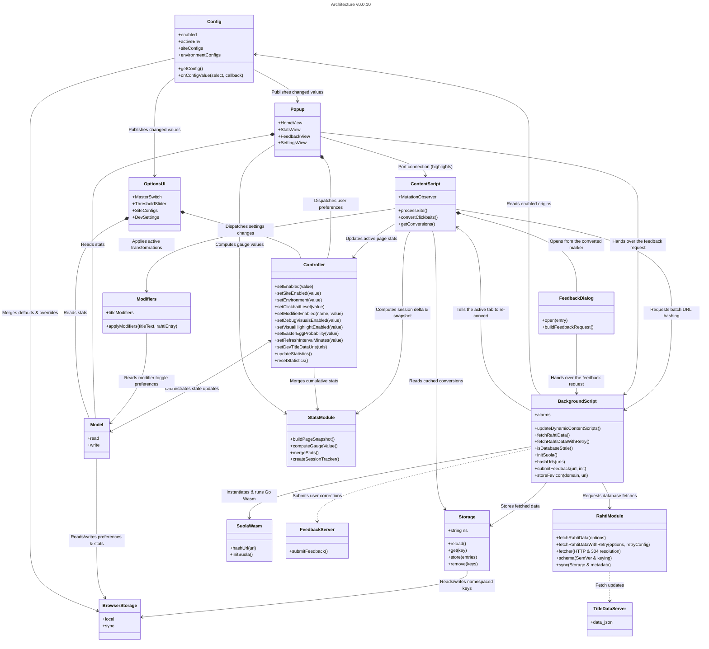

# Architecture

This diagram shows the modules of the Klikkikuri Paatti extension and the paths between them. It is maintained
by hand. If you change a module boundary, update it here.

Terms used below:

- **Rahti** is the published correction database (`data.json`). The extension downloads it and reads it
  locally. See [rahti](https://github.com/Klikkikuri/rahti).
- **Suola** is the WebAssembly module that normalizes and hashes URLs. The backend and the extension use the
  same module, so both sides agree on a signature. Its normalization rules live in `suola/rules.yaml`. See
  [suola](https://github.com/Klikkikuri/suola).

The popup and the in-page feedback card do not call the feedback server themselves. Both build the request and
give it to the service worker, which makes the one network call. `src/feedback.js` explains why.

